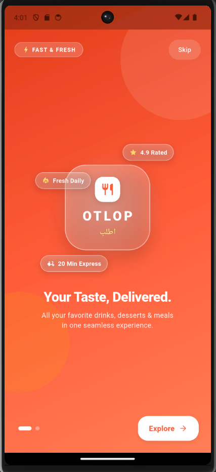
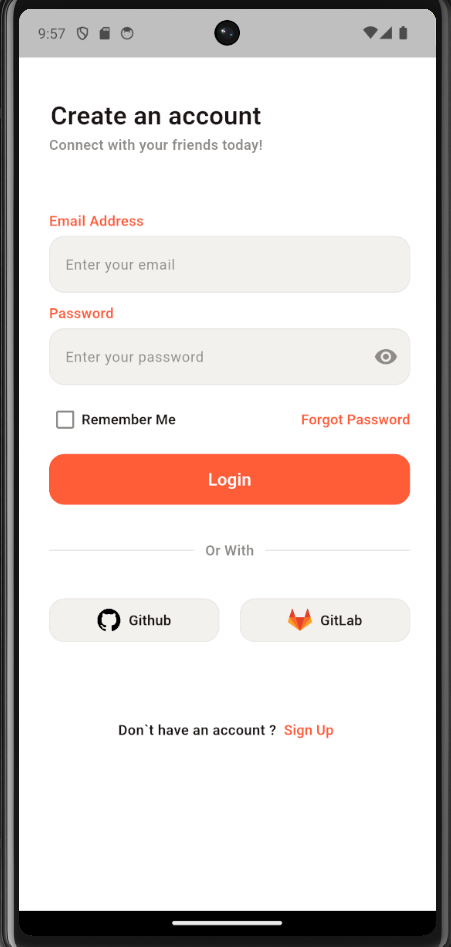
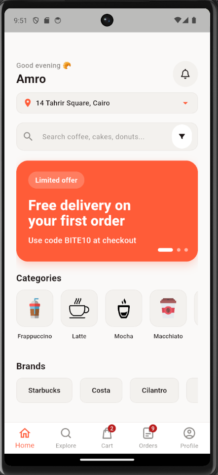
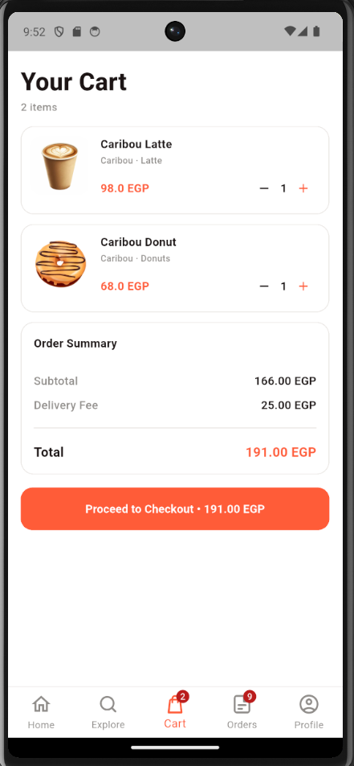

<div align="center">

# 🍽️ OTLOP (اطلب)

**Your Taste, Delivered.**
A Flutter food & drinks ordering app: coffee, desserts, and meals in one seamless experience.


</div>

---

## 📸 Screenshots

| Splash | Login | Home | Cart |
| :---: | :---: | :---: | :---: |
|  |  |  |  |

## ✨ Features

- **Onboarding:** animated splash screen with skip and explore actions
- **Authentication:** email and password login, remember me, forgot password, sign up, and GitHub / GitLab sign-in
- **Home:** personalized greeting, delivery address selector, search with filters, and promo banners
- **Discovery:** browse by categories (Frappuccino, Latte, Mocha, Macchiato) and brands (Starbucks, Costa, Cilantro)
- **Cart:** adjust item quantities, with an order summary showing subtotal, delivery fee, and total in EGP
- **Navigation:** bottom bar with Home, Explore, Cart, Orders, and Profile, plus live badge counters

## 🧰 Tech Stack

| Category | Package |
| --- | --- |
| Framework | Flutter (Dart `^3.9.2`) |
| State management | `flutter_bloc` |
| Networking | `dio` |
| Local storage | `hive`, `hive_flutter` |
| Maps & location | `google_maps_flutter`, `geolocator`, `geocoding` |
| UI assets | `flutter_svg`, `cupertino_icons` |

## 🚀 Getting Started

**Prerequisites:** [Flutter SDK](https://docs.flutter.dev/get-started/install) and a Google Maps API key.

```bash
git clone https://github.com/amrmarei-22/OTLOP_APP.git
cd OTLOP_APP
flutter pub get
flutter run
```

## 👤 Author

**Amr Marei** · [@amrmarei-22](https://github.com/amrmarei-22)